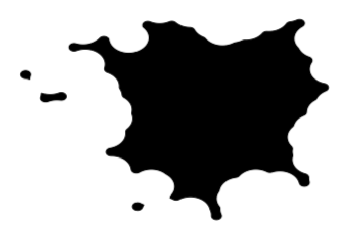
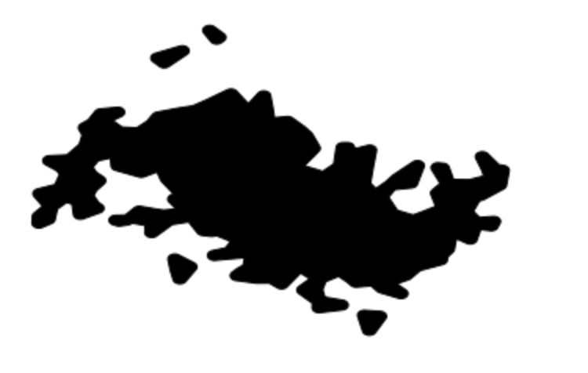

# Map Generation

> Pattern recognition applied to noisy inputs

This code repository contains my own recipies for generating fictional geographical maps with computer code. There is a large body of existing work[\[1\]](http://pcg.wikidot.com/pcg-algorithm:map-generation)[\[2\]](http://hjemmesider.diku.dk/~torbenm/Planet/)[\[3\]](http://simblob.blogspot.com/2010/09/polygon-map-generation-part-1.html), which my code is *not* based on, because I enjoy the creative process.

All my maps are generated with code in a single notebook.

[map-generation.ipynb](notebooks/map-generation.ipynb)

## Flat maps from noisy points

These maps are based on a set of noisy input points (gaussian and beyond) and then a spatial algorithm on top, e.g. buffer out/buffer in or alpha shape.

Some examples:

|buffer in/buffer out|alpha shape (plus a litte buffering)|
|---|---|
||


## How to run the code

You must have Python 3 already installed.

```
python3 -m venv venv
source venv/bin/activate
pip install -U pip
pip install -r requirements.txt
cd notebooks
jupyter notebook
# in the UI open the file "map-generation.ipynb"
```

## Acknowledgements

I'd like to thank the following people for inspiration: [Torben Ægidius Mogensen](http://hjemmesider.diku.dk/~torbenm/Planet/), [Amit Patel](http://www-cs-students.stanford.edu/~amitp/game-programming/polygon-map-generation/demo.html),
